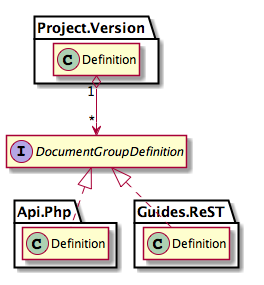

Version Definition
------------------

The Version Definition is an aggregate that describes how the Documentation should be built for a specific Version of
a Project. This means that it defines at what locations you can find Document Groups.

